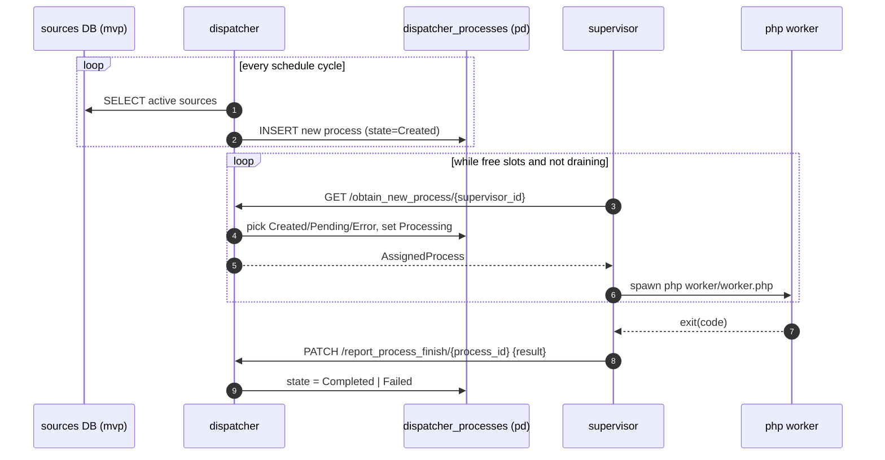

# process-dispatcher workspace

Distributed orchestration of PHP CLI worker processes: one planner (**dispatcher**) that
decides what should run and tracks state in MySQL, and a fleet of executors (**supervisor**)
that pick assigned work, launch child PHP processes, and report results back.

Designed to run on Kubernetes, but can be brought up locally via `docker-compose`.

## Crates

| Crate | Binary | Role |
|---|---|---|
| [`crates/shared`](crates/shared/README.md) | — | Shared wire types (`DispatchState`, `ProcessingMode`, `AssignedProcess`, `ProcessFinishReport`) and status constants. No business logic. |
| [`crates/dispatcher`](crates/dispatcher/README.md) | `process_dispatcher` | Schedules new processes per `source`, exposes HTTP API for supervisors, owns the `dispatcher_processes` table. |
| [`crates/supervisor`](crates/supervisor/README.md) | `process_supervisor` | Pulls assigned processes from dispatcher, spawns `php worker/worker.php`, enforces concurrency, reports results. Integrates with k8s lifecycle (drain / terminate). |

The split is intentional: dispatcher is stateful + DB-bound, supervisor is stateless
and horizontally scalable. They share **only** the `shared` crate, so any contract
change is a compile-time break on both sides.

## High-level flow



## Databases

Dispatcher connects to **two** MySQL schemas:

- `process_dispatcher` — owned by this project. Single table `dispatcher_processes`
  (see `crates/dispatcher/db/migrations/`). Source of truth for process state.
- `mvp` — owned by an **external legacy project** that manages the `sources` table.
  Dispatcher reads it to know which sources are active and how they should be
  prioritized. We do not own this schema; `db/mvp_migrations/` is a local copy
  sufficient to bring up a dev environment.

## Running locally

```bash
docker-compose up --build
```

Brings up:
- `mysql` on host port `13306` (both DBs auto-created from `create_database.sql`)
- `process_dispatcher` on `http://localhost:8089`
- `process_supervisor` on `http://localhost:8090`

Dispatcher entrypoint runs migrations for both schemas before starting the binary.

## HTTP contract (dispatcher ↔ supervisor)

| Method | Path | Direction | Purpose |
|---|---|---|---|
| `GET` | `/obtain_new_process/{supervisor_id}` | supervisor → dispatcher | Pull next assigned process. `200` with `AssignedProcess` JSON, `204` if nothing to do. |
| `PATCH` | `/report_process_finish/{process_id}` | supervisor → dispatcher | Report terminal result. Body: `ProcessFinishReport { process_id, result }` where `result ∈ {"success","error"}`. |

Request/response types live in `shared` to guarantee both sides stay in sync.

## Repository layout

```
process-dispatcher/
├── Cargo.toml                # [workspace] members = ["crates/*"]
├── docker-compose.yml        # local dev: mysql + dispatcher + supervisor
├── crates/
│   ├── shared/               # wire types only
│   ├── dispatcher/           # planner + HTTP API + DB access
│   │   ├── db/migrations/    # process_dispatcher schema
│   │   ├── db/mvp_migrations # dev copy of external sources schema
│   │   └── ops/docker/       # dispatcher Dockerfile + entrypoint
│   └── supervisor/           # executor + k8s controller
│       ├── worker/worker.php # placeholder child process
│       └── ops/              # Dockerfiles, k8s manifests
```

## Known gaps / TODO

All tracked gaps live in [`TODO.md`](TODO.md), grouped by scope
(cross-service contract, `shared`, `dispatcher`, `supervisor`). Update that
file instead of duplicating items here.
